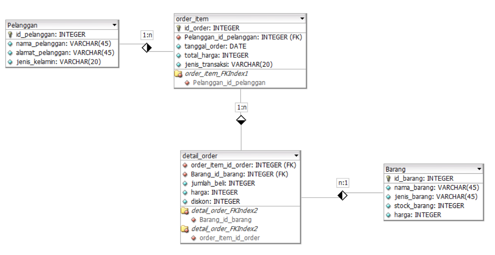

# TPA_04
membuat database di MySQL
Online Retail Database Design

Yang harus dilakukan :
1. download xampp : https://www.apachefriends.org/download.html
2. download mysql : https://dev.mysql.com/downloads/installer/
3. pastikan sudah memiliki code editor (disini saya menggunakan Visual Studio Code)
4. buatlah rancangan tabel database beserta relasinya, bisa menggunakan draw.io, apk dbdesigner, dan sebagainya
5. Tabel database yang saya buat
 
6. Buatlah database menggunakan code editor, jangan lupa aktifkan dan sambungkan code editor dengan MySQL anda
